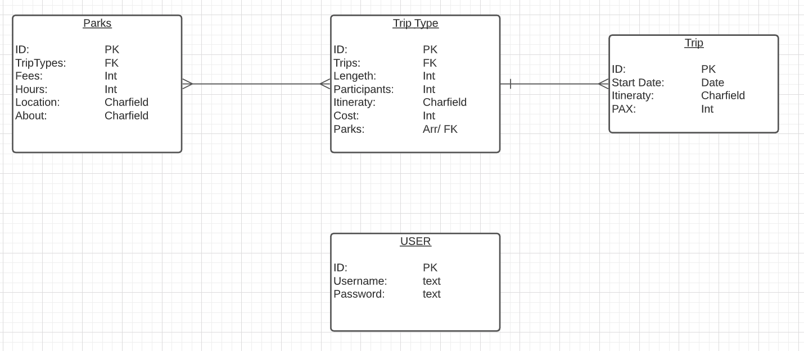
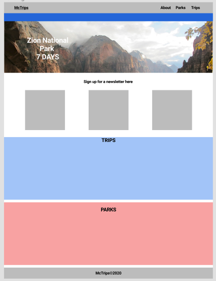
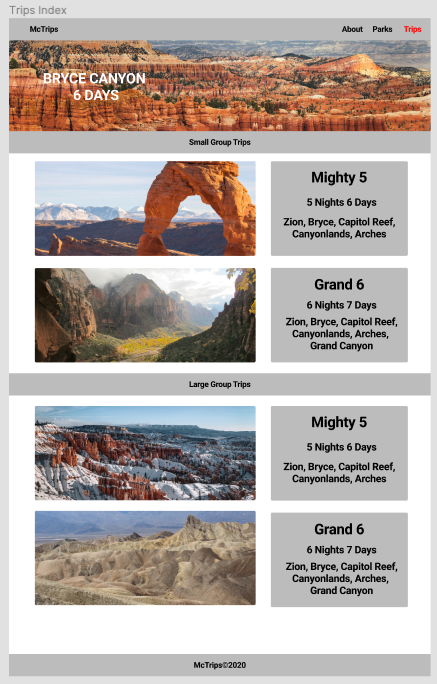
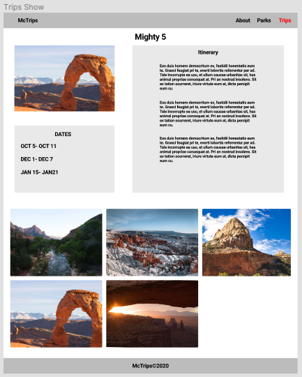

# GWE-API

## Index:

- [Overview](#Overview)
- [Link to Page](#Link-to-page)
- [ERD](#Entity-Relationship-Diagram)
- [Wireframes](#wireframes)
- [User Stories](#User-Stories)
- [Thanks](#Special-Thanks)

## Overview

This project was created using the MERN stack. The inspiration for this project was to create an app that my dad can use for work. He is in the tourism industry and has been out of work for months and the company he works for won’t be opening for about another year.

## Link to page

https://notworking.com

## Technologies & Libraries Used

* React
* Mongoose
* Express
* Node 
* MongoDB
* CSS
* JavaScript
* Google Fonts
* HTML

## Entity Relationship Diagram

## Wireframes
My wireframes were done on Figma. The link to the working file is [here](https://www.figma.com/file/EW2tPzdcsjpF7gAXATqPYI/Final), the link you the prototype is [here](https://www.figma.com/proto/EW2tPzdcsjpF7gAXATqPYI/Final?scaling=min-zoom&node-id=2%3A0).
* landing page

* Index page

* Show page

## User Stories
A list of installation steps for the app itself and any dependencies - how would another developer run your site locally?
Link to your user stories - who are your users, what do they want, and why?
Descriptions of any unsolved problems or future features.
 

## Planned Features

* asdfasdfasdfasdf

## Special Thanks

* Allison ( My favorite Deputy )
* Lucian
* Zach
* Yulia
* Michael
* Melisa
* Dani <3
* Kevin Bacon

